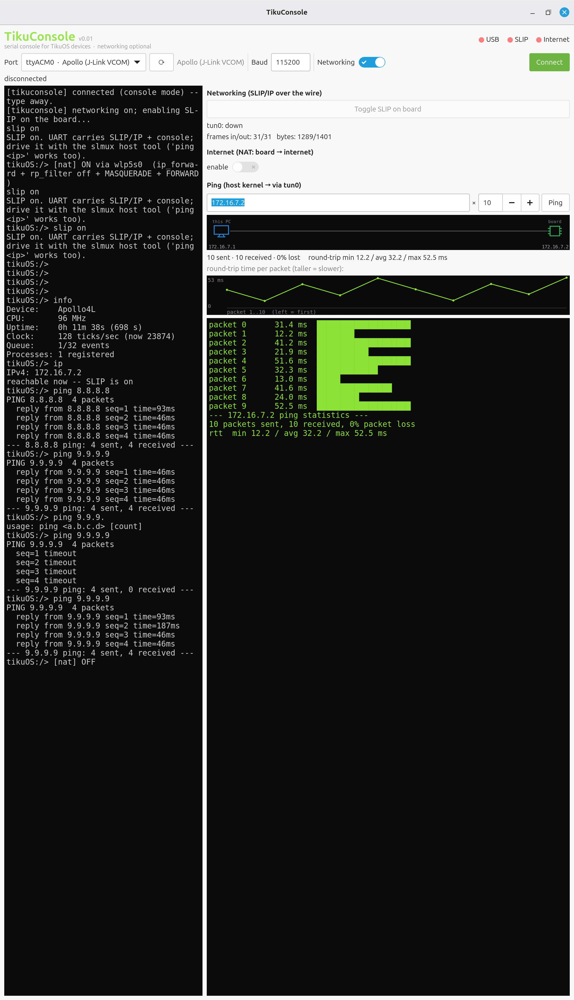

# TikuConsole

TikuConsole is a serial console and network bridge for
[TikuOS](http://tiku-os.org)-powered computers. Over the board's serial link it
gives you an interactive shell, and bridges that same wire onto IP — connecting
the board to the internet and to the host's network.



## Requirements

- Python 3, PyGObject with **GTK 4**, and **pyserial**.

```bash
# Debian / Ubuntu
sudo apt install python3-gi gir1.2-gtk-4.0 python3-serial
```

A TikuOS board built with the net stack (`slip`/`ping`) on the other end.

## Run

```bash
python3 tikuconsole.py          # plain console + rootless ping — no root needed
sudo python3 tikuconsole.py     # also enables the host TUN/NAT bridge
```

1. Plug in a board — the port, platform and baud auto-fill. Click **Connect**.
2. Type into the console.
3. For networking, flip **Networking**: toggle SLIP on the board, **Ping** it,
   and (as root) enable **NAT** to give the board internet.

### Headless / env vars

```bash
TIKUCONSOLE_SCAN=1     python3 tikuconsole.py   # list ports + guesses, then exit
TIKUCONSOLE_SMOKE_MS=1200 python3 tikuconsole.py # build the window, quit (CI smoke)
TIKUCONSOLE_NO_SPLASH=1 python3 tikuconsole.py  # skip the splash screen
```

## Addresses

Point-to-point SLIP link: device **172.16.7.2**, host **172.16.7.1**. The
device address is set on the firmware side (`make … IP=10.0.0.5`); keep both
ends in sync if you change it.

## License

Apache-2.0 © TikuOS · Ambuj Varshney &lt;ambuj@tiku-os.org&gt;
